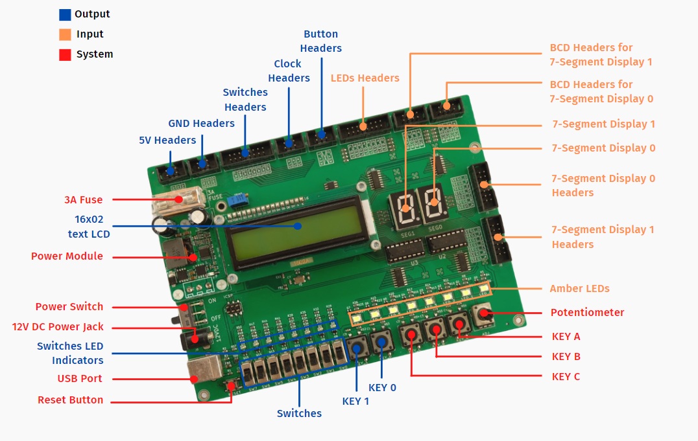

# INTRODUCTION TO TICKIT VER1.0 - DIGITAL SYSTEM KIT
Item: Digital System KIT

Date: Jan 10th, 2022

Delivered to: HCMUT CE-LAB

Designed in Vietnam

    3D Render Board with KiCad.

## TICKIT include all below function block: 
- PWM Generator with  microcontroller ATMEGA64A.
- Display LCD with 16x2 characters.
-  5 Buttons 12x12 mm.
- 8 Switchs 21.1x5.5 mm.
- 8 Display LEDs size 3.5x2.8 mm.
- 2 7- segment LEDs.

Product Introduction in CSE Facebook page :[ KIT thí nghiệm môn học Hệ thống số do thầy và trò Khoa KH&KTMT thiết kế và phát triển](https://www.facebook.com/2180160732207910/posts/3021461968077778/).

    Some functional blocks in TICKIT.

##  What's in the Box?
1. TickLab-DSKiT 1.0 Board.

2. TickLab-DSKiT 1.0 Quick Start Guide.

3. Small Screwdriver.

## Documentations and Resources
Available for free access at https://ticklab.vn/dskit

## Getting ready
1. Make sure a 3A fuse tube is properly inserted.

2. Connect the power adapter to the power jack on the board, then turn on the power switch.

3. As soon as the board is powered up, the self-test must be started. The amber LED and 7-segment display will blink at 2Hz during the self-test so you can detect early if any LEDs are dead.

## Fatal Cautions

1. DO NOT connect any outputs to another output. Connecting an output to another one may cause circuit damage, a fire, or an explosion despite a 3A fuse installed.

2. Keep liquid or no-used metal things far away from the board to avoid making a short circuit.